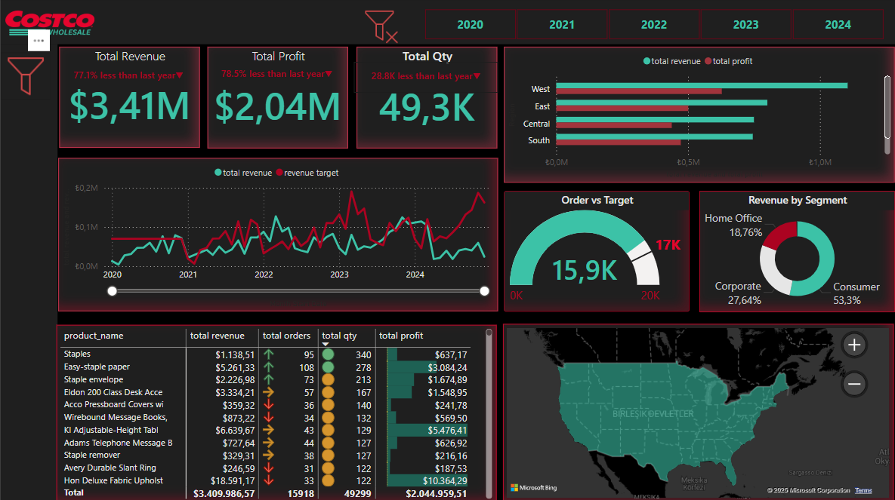
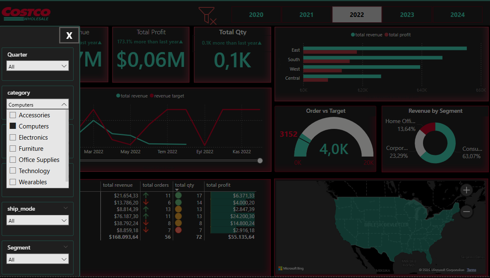

# wholesale_power_bi_project

# Power BI Dashboard for Global Sales Analysis

## Dashboard Overview

This project involves the development of an interactive Power BI dashboard for analyzing **Global Sales Data**. The dashboard provides insights into key performance indicators (KPIs) such as **profit, quantity, revenue, and year-over-year (YoY) comparisons**. It enables users to track performance trends and monitor revenue targets efficiently.

---

## **Objective**
The main objective of this project is to create an intuitive dashboard that visualizes key metrics and enhances data-driven decision-making.

### **Key Goals:**
- Implement **Year-over-Year (YoY) comparisons** for profit, quantity, and revenue.
- Track **total orders, total profit, total quantity, and total revenue**.
- Define and monitor **revenue targets**.
- Create a **user-friendly and interactive** analytics experience.

---

## **Data Sources & Structure**

This project integrates and processes data from the following key tables:

### **1. Customers Table**
Contains customer information such as:
- **Customer ID**
- **Customer Name**
- **Segment** (Consumer/Home Office)
- **Location Details** (Country, City, State, Region, Postal Code)

### **2. Products Table**
Includes product-related information:
- **Product ID**
- **Product Name**
- **Category & Sub-Category**
- **Unit Price**
- **Cost of Goods Sold (COGS)**

### **3. Global Sales Table**
Holds transactional data such as:
- **Order ID, Order Date, Ship Date**
- **Shipping Mode**
- **Customer & Product IDs** (Foreign Keys)
- **Quantity Sold**
- **Discount Applied**

---

## **Measures & KPIs Developed**

Several **DAX measures** were created to derive key insights from the dataset:

1. **KPI: Profit YoY (%)** - Measures the year-over-year growth in profit.
2. **KPI: Quantity YoY (%)** - Compares sold quantity with the previous year.
3. **KPI: Revenue YoY (%)** - Tracks revenue growth trends.
4. **Revenue Target** - Defines a revenue goal and compares it with actual revenue.
5. **Total Orders** - Calculates the total number of sales orders.
6. **Total Profit** - Computes total profit based on revenue and cost.
7. **Total Quantity** - Aggregates the total number of products sold.
8. **Total Revenue** - Summarizes overall revenue from sales transactions.

---

## **Dashboard Features**
- **Interactive Filters & Slicers:** Users can filter data dynamically based on customers, products, and time periods.
- **Time-Based Analysis:** Includes **Year-over-Year (YoY) calculations** to measure business growth.
- **Revenue & Profitability Metrics:** Helps stakeholders track financial performance.
- **Custom DAX Measures:** Enables in-depth data insights beyond standard Power BI functionalities.
- **User-Friendly Visuals:** Includes bar charts, line charts, KPIs, and tables for easy interpretation of sales trends.

---

## **Technology Stack**

- **Power BI:** Dashboard development and visualization.
- **DAX (Data Analysis Expressions):** Custom measures and KPIs.
- **Power Query:** Data transformation and cleaning.
- **Excel & CSV:** Data preprocessing and import.

---

## **Final Output**

